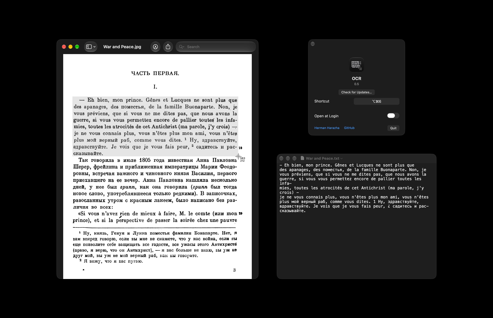

<picture><source media="(prefers-color-scheme: dark)" srcset="docs/icon-github-dark.png"></picture>

# OCR

Screen text recognition for Mac. The text of any selected area of the screen is copied to the clipboard.



Apple silicon, macOS 13 or later.

## Install

```sh
brew install geragarazagh/tap/ocr
```

Or download [`OCR.dmg`](https://github.com/geragarazagh/ocr/releases/latest/download/OCR.dmg).
